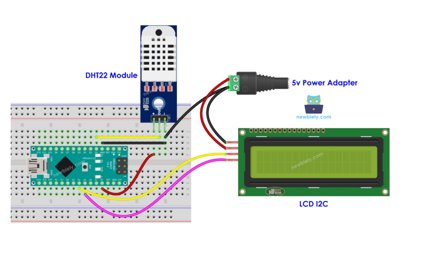

# Sound Distress Monitoring System

An Arduino-based monitoring system designed for classroom environments to detect distress sounds and unsafe environmental conditions, automatically sending SMS alerts and activating audible warnings.


## Overviewrview

This system continuously monitors:

- **Sound Levels**: Detects high-distress noise in the classroom
- **Temperature**: Monitors ambient temperature (alert if > 32°C)
- **Humidity**: Monitors ambient humidity (alert if < 25%)

When unsafe conditions are detected, the system:

1. Sends SMS alerts to designated phone numbers
2. Activates a buzzer alarm after a configurable delay
3. Displays real-time data on an LCD screen

## Hardware Requirements

| Component    | Pin/Model                              | Purpose                       |
| ------------ | -------------------------------------- | ----------------------------- |
| Arduino      | Any ESP32/Arduino                      | Main controller               |
| DHT11        | Pin 15                                 | Temperature & Humidity sensor |
| Sound Sensor | Pin 32                                 | Sound level detection         |
| Buzzer       | Pin 23                                 | Audible alarm                 |
| SIM800L      | RX: 8, TX: 9                           | SMS module                    |
| LCD 16x2     | RS:22, EN:21, D4:4, D5:5, D6:18, D7:19 | Display                       |

## Pin Configuration

```
DHT11 Sensor     : Pin 15
Sound Sensor    : Pin 32
Buzzer          : Pin 23
SIM800L RX      : Pin 8
SIM800L TX      : Pin 9
LCD RS          : Pin 22
LCD EN          : Pin 21
LCD D4          : Pin 4
LCD D5          : Pin 5
LCD D6          : Pin 18
LCD D7          : Pin 19
```

## Software Dependencies

Install the following libraries via Arduino Library Manager:

- `DHT sensor library` - For DHT11 temperature/humidity sensor
- `SoftwareSerial` - For SIM800L communication (built-in)
- `LiquidCrystal` - For LCD display (built-in)

## Configuration

### Thresholds

Modify these values in [`main/main.ino`](main/main.ino) to adjust sensitivity:

```cpp
int soundThreshold = 100;      // Sound level threshold (0-1023)
int durationThreshold = 3000; // Duration in ms (currently unused)
```

### Phone Number

Update the phone number in [`sendSMS()`](main/main.ino:54) function:

```cpp
sim.println("AT+CMGS=\"+254XXXXXXXXX\""); // Replace with your number
```

### Timing Parameters

```cpp
const unsigned long buzzerDelay = 5000;    // 5 seconds delay before buzzer activates
const unsigned long buzzerDuration = 2000; // 2 seconds buzzer duration
```

## Installation

1. **Hardware Setup**

   - Connect all components according to the pin configuration
   - Ensure proper power supply (SIM800L requires 5V, 2A)
   - Insert a working SIM card in the SIM800L module
2. **Software Setup**

   - Open [`main/main.ino`](main/main.ino) in Arduino IDE
   - Select your board (ESP32 or Arduino Uno/Nano)
   - Install required libraries
   - Update phone number in the code
   - Upload to your board
3. **Testing**

   - Monitor Serial output for status messages
   - Test sound detection by making loud noises
   - Test environmental alerts by increasing temperature or decreasing humidity

## How It Works

### Sound Detection

1. Reads analog sound level from sensor (0-1023 scale)
2. If sound exceeds threshold (100), triggers SMS alert
3. After 5-second delay, activates buzzer for 2 seconds

### Environmental Monitoring

1. Reads temperature and humidity from DHT11 sensor
2. If temperature > 32°C or humidity < 25%, triggers SMS alert
3. Activates buzzer with lower frequency tone (800Hz) vs sound alert (1200Hz)

### Alert Reset

- All alerts automatically reset when conditions return to safe levels
- System continues monitoring continuously

## LCD Display

The LCD displays:

- **Line 1**: Temperature (T:xxC) and Humidity (H:xx%)
- **Line 2**: Sound level (S:xxx) and Buzzer status (BUZZ:ON/OFF)

## Serial Output

Monitor via Arduino IDE Serial Monitor (9600 baud):

- Current temperature and humidity
- Sound level reading
- Buzzer status
- Alert status flags

## Troubleshooting

### No SMS Received

- Verify SIM card has credit and signal
- Check phone number format (include country code)
- Ensure serial communication with SIM800L is working

### LCD Not Displaying

- Check all LCD pin connections
- Verify contrast potentiometer is adjusted
- Check LiquidCrystal initialization

### Buzzer Not Working

- Verify buzzer is connected to correct pin
- Check buzzer is functional
- Ensure buzzerOn/buzzerOff functions are being called

## Project Structure

```
Sound-distress-monitoring-system/
├── Readme.md                 # This file
├── .gitignore                # Git ignore rules
├── main/
│   └── main.ino              # Main Arduino sketch
└── Documentation/
    └── doc3.docx             # Project documentation
```

## License

This project as-is for educational is provided purposes.

## Author

Created for classroom safety monitoring applications.
